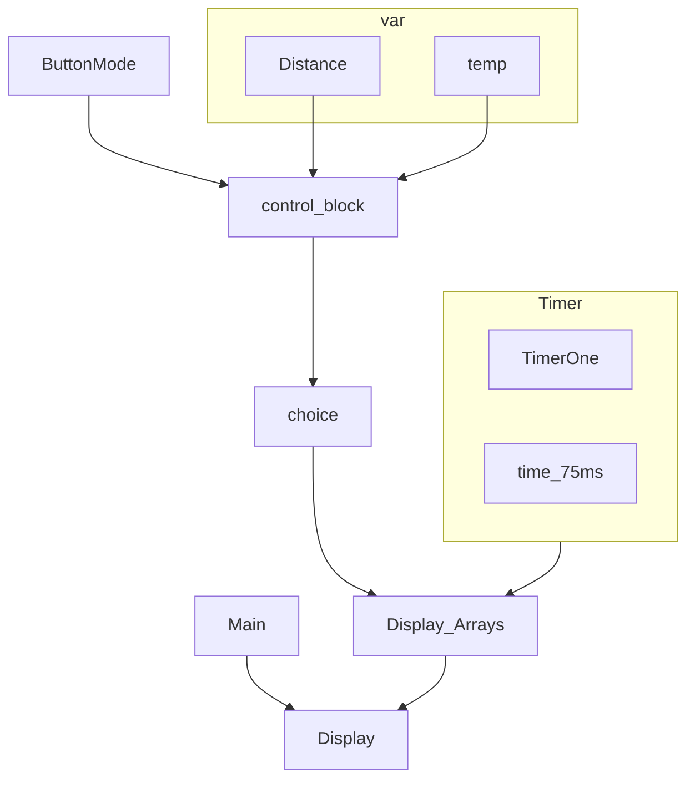

# EELab Sem 2 final project 2022 No library challenge 

#### Written by **KYLiN** 
#### gifted to ***MP Liew*** 

---

You only need to download the library call ```TimerOne```

This library is using for display function in cycle 

You can clack this link to know more about how to download library 

- TimerOne
- - https://github.com/PaulStoffregen/TimerOne
  
- Download doc
- - https://docs.arduino.cc/software/ide-v1/tutorials/installing-libraries

---
# Setting pin 
About the setting pin 

> **Display pin**


> **Button pin setting**


> **Temp setting pin**


> **Distance Setting**


--- 
# Flow chart 



